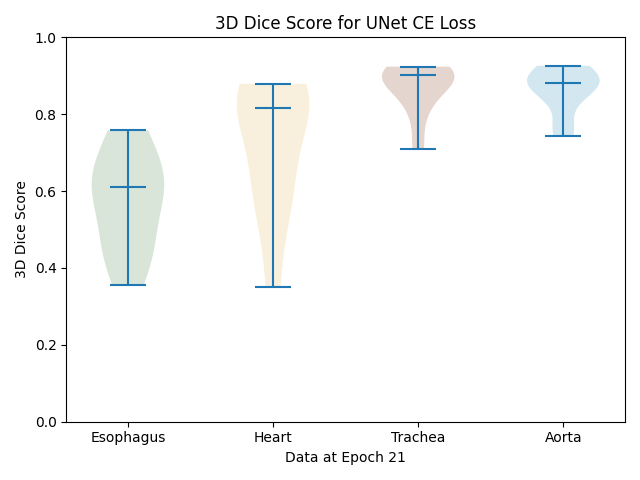

# AI for medical imaging - Segmentation on SegTHOR

## Research overview
The project is based on the SegTHOR dataset, which focuses on segmenting different organs: the heart, aorta, esophagus, and trachea. Our research explores various deep learning models and their applicability in medical image segmentation. The SegTHOR dataset presents a unique challenge due to the lack of contrast between organs, making it an ideal testbed for experimenting with segmentation models. We have based our research on the original repository: https://github.com/HKervadec/ai4mi_project. **While we retain all core features related to data processing, plotting, and other functionalities, this README emphasizes the changes and enhancements we have implemented to adapt the codebase for our research objectives.**

## Codebase Features
This codebase provides a foundation for training and evaluating neural networks for 2D and 3D segmentation tasks. It enables rapid experimentation and modification of different models, with some initial architectures and tools provided. Key features include:

* Data Processing: Tools to convert 3D Nifti files into 2D .png slices, and stitch predictions back into 3D volumes compatible with the original Nifti format.
* Model Options: Basic implementations of U-Net, Attention U-Net, and ENet models, designed for various segmentation tasks.
* Training and Evaluation: Scripts for training neural networks with cross-entropy loss, partial class exclusion, and validation using the metric.
* Metrics and Plotting: Tools for logging and plotting key metrics such as Dice, Hausdorff and IoU and different losses over time.
* Pre- and post-processing functions such as affine transformation and morphological operations.
* The modular design of the codebase allows users to easily add new models or customize the training workflow.

## Codebase Use
### Setting up the environment and data
For the precise setup of the data and the environment we refer to the original repository: https://github.com/HKervadec/ai4mi_project. 
However when running on snellius some nodes are set up with different configurations (i.e. older versions of python etc.). Therefore we have included a script under /scripts/setup_py_env.sh which you can run when you are experiencing issues with your environment when running our code:
```
$ ./scripts/setup_py_env.sh
```

### SegTHOR Transformed Dataset
In order to calculate an affine transformation and run it on the entire dataset, we have provided a few scripts to facilitate this.
By running the following command, you calculate the affine matrix:
```
srun python affine.py --data_dir "$DATA_DIR" \
                      --fixed_image "$FIXED_IMAGE" \
                      --moving_image "$MOVING_IMAGE" \
                      --transform_file "$TRANSFORM_FILE"
```
Then you can run `slice.py` from the original repository to slice the dataset with this matrix. After this, you can specify `SEGTHOR_transformed` as dataset argument when running a model.

### Train the models
Running a training
```
usage: main.py [-h] [--epochs EPOCHS] [--dataset {TOY2, SEGTHOR, SEGTHOR_transformed}] [--mode {partial, full, balanced, focal, combined}] --dest DEST [--model {UNet, ENet, UNetAttention}] [--gpu] [--debug] [--optimizer {Adam, AdamW}] [--hyper_parameter LEARNING_RATE] [--k_folds K_FOLDS]

options:
  -h, --help              show this help message and exit
  --epochs EPOCHS         Number of training epochs (default: 200)
  --dataset {TOY2, SEGTHOR, SEGTHOR_transformed}
                          Choose the dataset to use (default: TOY2)
  --mode {partial, full, balanced, focal, combined}
                          Choose the training mode to use (default: full)
  --dest DEST             Destination directory to save the results (predictions and weights)
  --model {UNet, ENet, UNetAttention}
                          Choose the model architecture (default: UNet)
  --gpu                   Flag to enable GPU for training
  --debug                 Use a fraction of the dataset for debugging (10 samples)
  --optimizer {Adam, AdamW}
                          Choose the optimizer to use (default: AdamW)
  --hyper_parameter LEARNING_RATE
                          Specify the learning rate or hyper-parameter (default: 1e-5)
  --k_folds K_FOLDS       Number of folds to use for cross-validation (default: 1)

```

The codebase uses a lot of assertions for control and self-documentation, they can easily be disabled with the `-O` option (for faster training) once everything is known to be correct (for instance run the previous command for 1/2 epochs, then kill it and relaunch it):
```
srun python -O main.py --dataset SEGTHOR_transformed \
                      --mode combined \
                      --epoch 25 \
                      --dest results/unet_attention3/ce \
                      --gpu \
                      --model UNetAttention \
                      --k_folds 1
```
For convenience, we have added job file templates to run the training on snellius (`/job_files`)

### K-fold Cross Validation
The argument `--k_folds` specifies the number of folds that you can run in k-folds cross validation. Specify `--k_folds` to run normal training.

### Running inference
To run inference on a trained model, we have provided a python script `inference.py`. This script helps set up the environment, load the best model weights, and execute the inference script to generate predictions.
Example command for local inference:
```
$ python inference.py --dataset SEGTHOR_TESTSET --model UNetAttention --weights path/to/bestweights.pt --dest results/inference-unet_attention --gpu
```
When running in snellius, there are job templates provided as well under the aformentioned folder.

### Plotting Results

Fig. 1, the violin plot from the results section of our paper.

The visualizations in the paper can be reproduced with the python files in the `visualization` directory.
For example, to create a violin plot using the provided script, you can run the following command:

```
$ python plot_violin.py --metric_file results/segthor/ce/metric_val.npy \
    --dest results/segthor/ce/violin_plot.png \
    --epoch 25 \
    --plot_title "Validation Metric Distribution" \
    --y_label "Metric Score" \
    --x_label "Classes" \
    --set_ylim True \
    --ylim_lower 0.5 \
    --ylim_upper 1.0 \
    --headless
```

## Contributors - Group 5
The contributors to this repository are:
* Richter van Emmerik
* Lisa Menzel
* Shabeeh Fatima
* Doris Wezenburg
* Maarten Drinhuyzen
